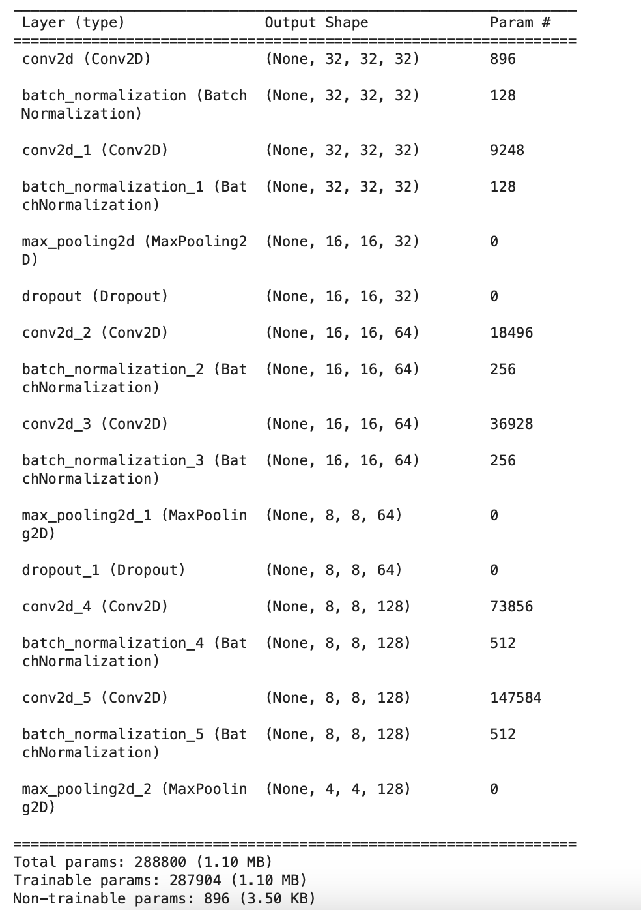
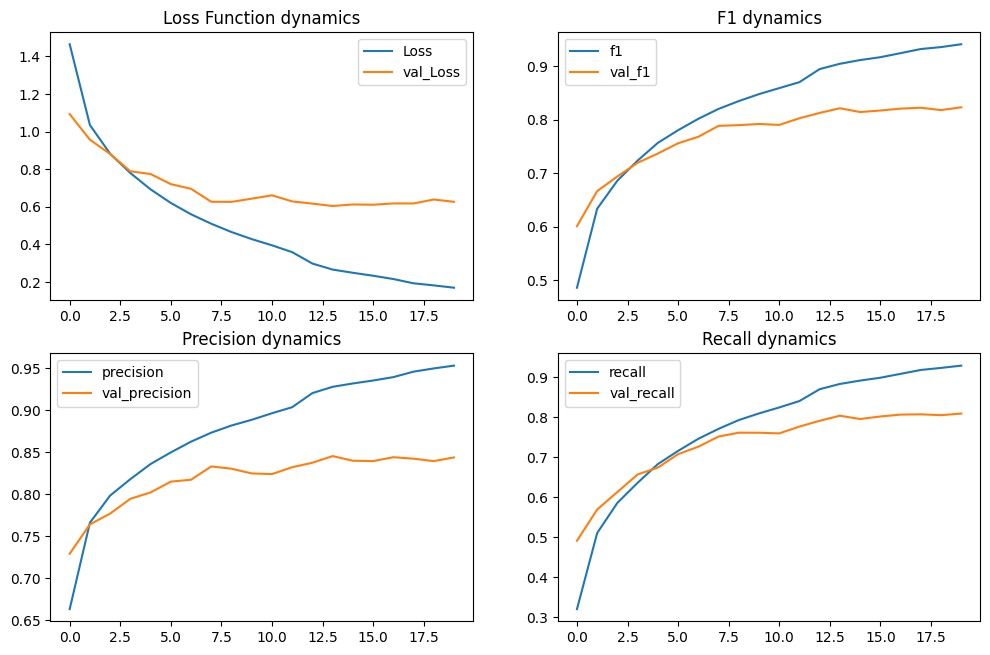
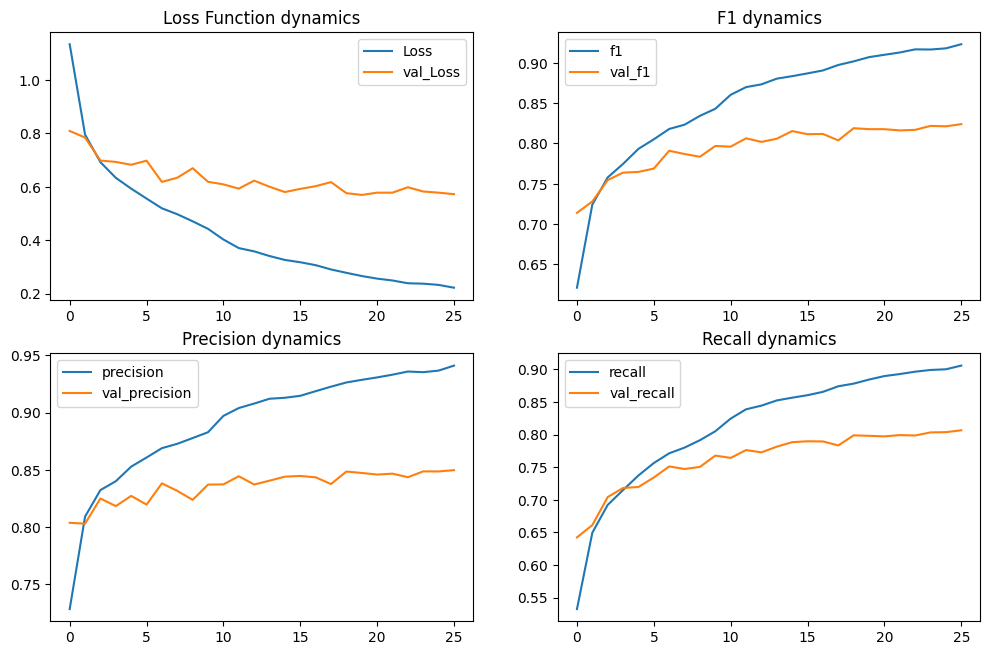
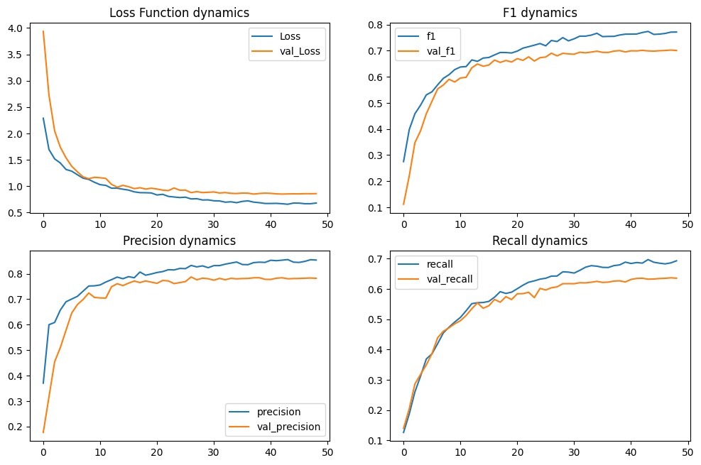
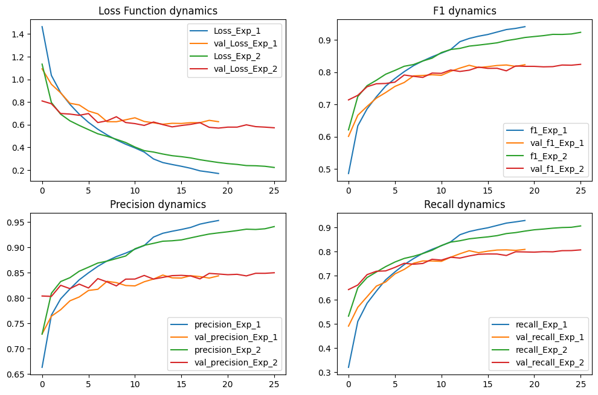
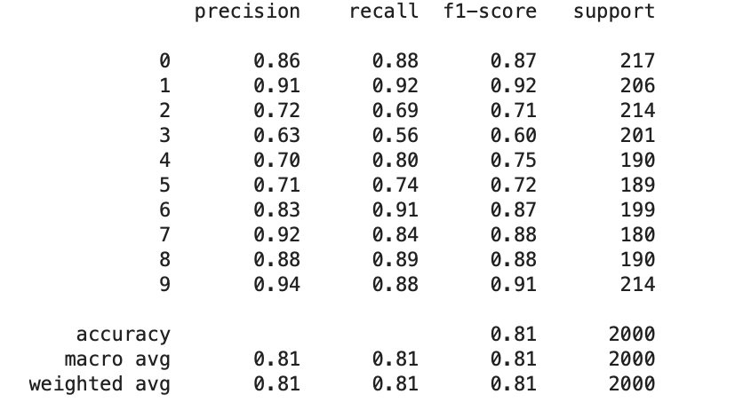
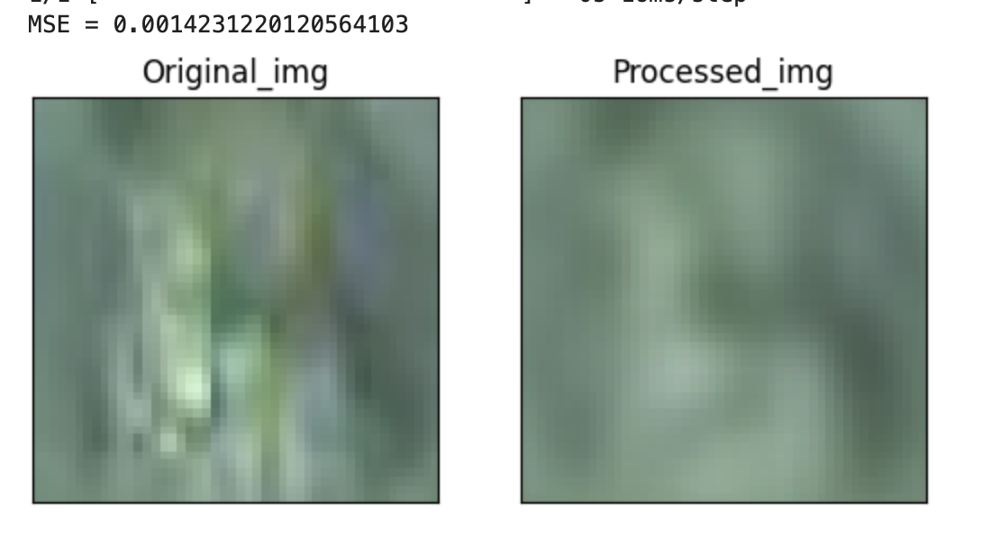

# Обработка и генерация изображений
## Домашняя работа № 3

Лакиза Александр Николаевич

- Задача множественной классификации
- Датасет CIFAR-10
- Собственная архитектура

#### 1 эксперимент (Предобучение Feature Extractor + 100% датасета)
Архитектура Feature Extractor:  

Метрики в первом эксперименте:  

- Метрики получились чуть выше чем в ДЗ 1
- Однако эта модель обучается быстрее
- На графиках видно, что валидация не совпадает с трейном

#### 2 эксперимент (50% датасета)
Метрики во втором эксперименте:  

- Метрики совсем-совсем немного стали лучше. Даже можно сказать, что они равни метрикам из эксперимента 1

#### 3 эксперимент (10% датасета)
Метрики в третьем эксперименте:  

- Метрики стали хуже
- Графики валидации и трейна похожи
- Обучилась модель очень быстро

#### Итоги
- Лучшими стали модели из 1 и 2 эксперимента
- Они обе чуть лучше чем модель из ДЗ 1
- Хотя у обоих этих моделей график валидации раньше уходит в плато, чем в 3 эксперименте

Модели из 1 и 2 экспериментов ведут себя настолько одинаково, что их графики выглядят следующим образом:  

Лучшие метрики в этой ДЗ:  

Пример работы:  
