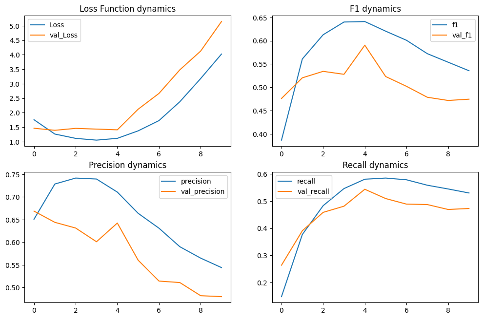
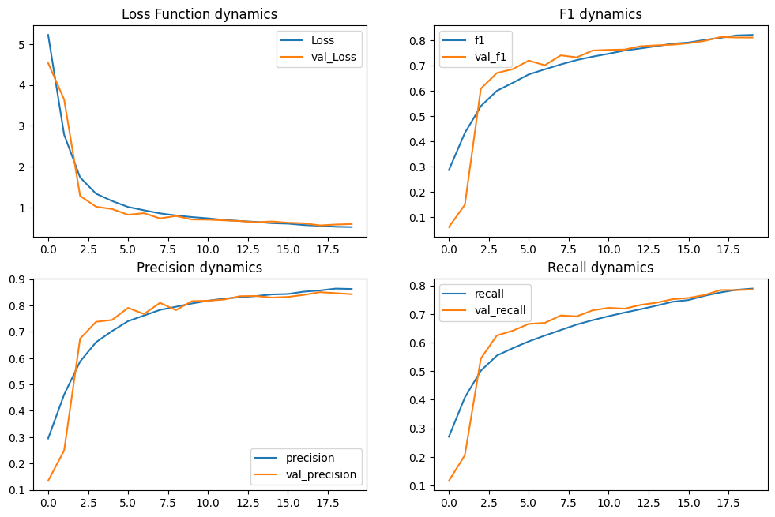
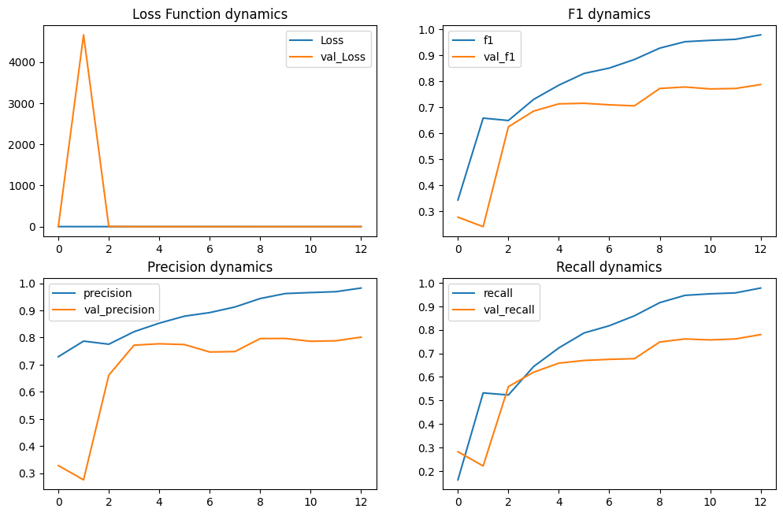
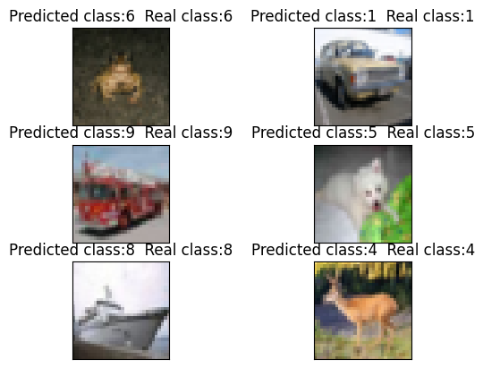

# Обработка и генерация изображений
## Домашняя работа № 1

Лакиза Александр Николаевич

- Задача множественной классификации
- Датасет CIFAR-10

#### 1 эксперимент
Обычная модель с парой сверточных слоев – бейзлайн

#### 2 эксперимент
Усложнил модель: добавил сверточные слои, дропаут, батчнорм; попробовал другой оптимизатор

#### 3 эксперимент
Взял архитектуру ResNet

#### Итоги
Лучшей стала модель из второго эксперимента  
Пример ее работы:
