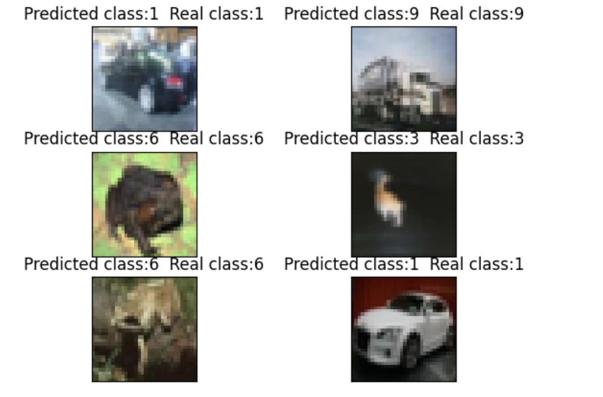

# Обработка и генерация изображений
## Домашняя работа № 2

Лакиза Александр Николаевич

#### Автоэнкодер
Проведена небольшая предобработка изображений - обрезаны 10% изображения с каждого края + приведены все изображения к одному размеру   
  
  

#### Поиск оптимального MSE
- С помощью дерева решений  
  
- с помощью ROC-кривой

#### Результат
Один из способов поиска порога сумел дать необходимый результат  
- `TPR` = 0.912   
- `TNR` = 0.924
